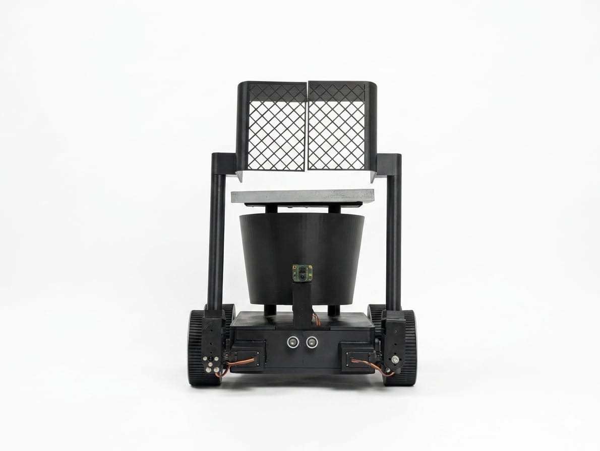
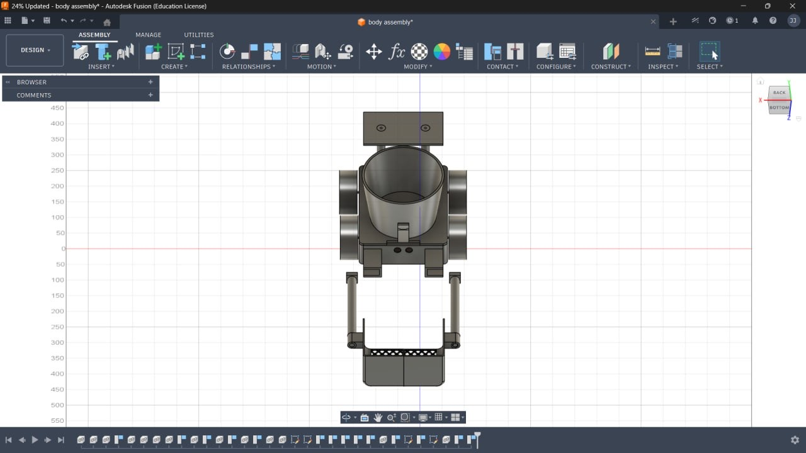
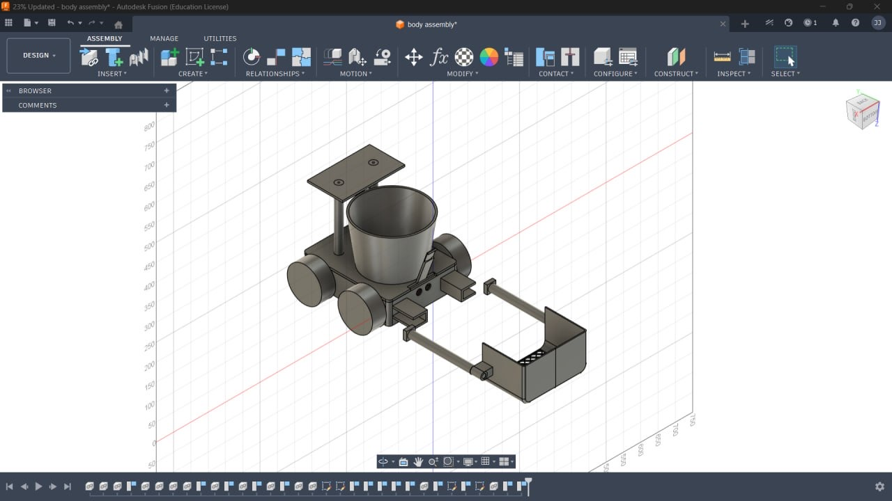
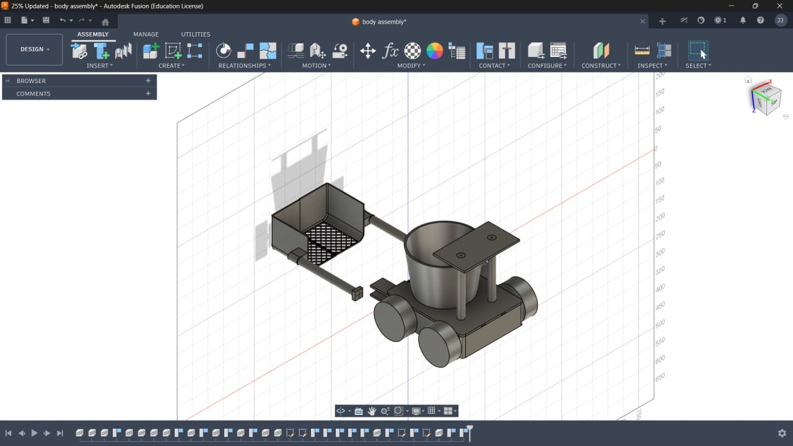
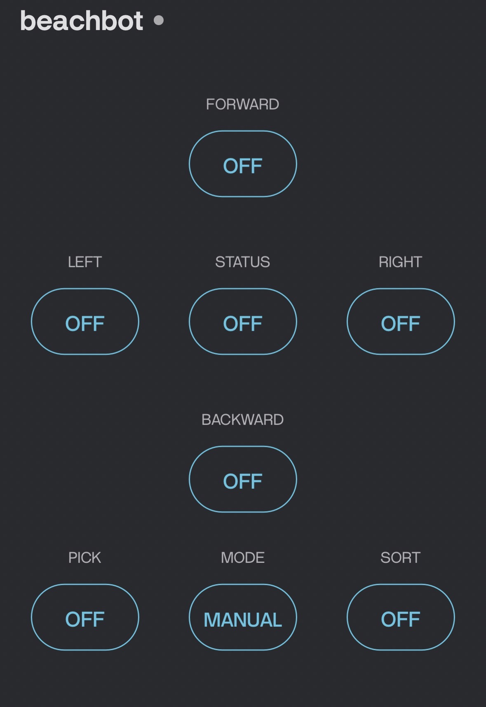

<p align="center">
  
</p>

# 🌊 Solar-Powered Autonomous Beach Cleaning Robot

An AI-powered autonomous robot designed to detect, collect, and sort beach waste using computer vision, embedded systems, and renewable energy.

---

## 📖 Overview

The **Solar-Powered Autonomous Beach Cleaning Robot** is an eco-friendly solution developed to automate beach cleaning and promote sustainable waste management. The robot autonomously detects waste using **YOLOv8** running on a **Raspberry Pi 5**, collects it using a robotic arm, and automatically sorts it into **plastic** and **non-plastic** compartments.

The robot operates using a rechargeable battery supported by a solar panel, enabling sustainable operation. It supports both **Autonomous Mode** and **Manual Mode** through the **Blynk IoT** platform.

---

## ✨ Features

- ☀️ Solar-powered operation
- 🤖 Autonomous waste detection
- ♻️ Automatic waste sorting (Plastic / Non-Plastic)
- 🦾 Robotic arm for waste collection
- 📷 YOLOv8-based object detection
- 🚧 Ultrasonic obstacle avoidance
- 📱 Manual control using Blynk IoT
- 🚙 Differential drive mobility
- 🔋 Rechargeable battery with solar charging

---

## 🛠 Hardware Used

- Raspberry Pi 5
- ESP32 Development Board
- Raspberry Pi Camera Module V2
- L298N Motor Driver
- MG996R Servo Motors
- 12V DC Geared Motors
- Ultrasonic Sensor
- Solar Panel
- Li-ion Battery Pack
- Robot Chassis

---

## 💻 Software Used

- Python
- Arduino IDE
- OpenCV
- YOLOv8
- Blynk IoT
- ESP32 Libraries

---

## ⚙️ Working Principle

1. The camera continuously captures the surrounding environment.
2. Raspberry Pi processes the images using YOLOv8 to detect waste.
3. The detected waste is classified as **Plastic** or **Non-Plastic**.
4. The robot navigates towards the detected object.
5. A robotic arm collects the waste.
6. The waste is deposited into the corresponding collection compartment.
7. Ultrasonic sensors detect obstacles and help avoid collisions.
8. The robot can also be manually controlled through the Blynk mobile application.

---

## 🚀 Operating Modes

### Autonomous Mode

- AI-based waste detection
- Automatic navigation
- Obstacle avoidance
- Waste collection
- Automatic waste sorting

### Manual Mode

- Remote control using Blynk
- Direction control
- Manual waste collection

---

## 📂 Repository Structure

```text
Solar-Powered-Autonomous-Beach-Cleaning-Robot/
│
├── docs/          # Project report and presentation
├── hardware/      # CAD models and datasheets
├── images/        # Prototype, CAD model and dashboard images
├── videos/        # Demonstration videos
├── README.md
├── LICENSE
└── .gitignore
```

---

# 📸 Project Gallery

## Final Prototype

| Front View | Rear View |
|------------|-----------|
| .JPG) | .JPG) |

---

## CAD Model

| View 1 | View 2 | View 3 |
|--------|--------|--------|
|  |  |  |

---

## Blynk Dashboard

<p align="center">

</p>

---

## 🎥 Demonstration

The completed robot was successfully tested for autonomous navigation, waste detection, waste collection, and automatic waste sorting.

Working videos are available in the **videos** folder:

- 🎥 Working_Video(1).MP4
- 🎥 Working_Video(2).MP4

---

## 📊 Results

The developed robot successfully demonstrated the following functionalities:

- ✅ Autonomous waste detection using YOLOv8
- ✅ Automatic waste collection using a robotic arm
- ✅ Waste classification into Plastic and Non-Plastic
- ✅ Automatic waste sorting into separate compartments
- ✅ Obstacle detection and avoidance using ultrasonic sensors
- ✅ Manual operation through the Blynk IoT application
- ✅ Solar-assisted battery charging for sustainable operation

The completed prototype was successfully tested for navigation, waste collection, and waste sorting under controlled conditions.

---

## 🛠 Hardware Specifications

| Component | Specification |
|-----------|---------------|
| Controller | Raspberry Pi 5 |
| Secondary Controller | ESP32 |
| Camera | Raspberry Pi Camera Module V2 (8 MP) |
| Object Detection | YOLOv8 |
| Motor Driver | L298N |
| Drive Motors | 12V DC Geared Motors |
| Robotic Arm | MG996R Servo Motors |
| Sensor | Ultrasonic Sensor |
| Power Source | Li-ion Battery Pack |
| Charging | Solar Panel |
| IoT Platform | Blynk |

---

## 🔮 Future Improvements

- Multi-category waste sorting
- GPS-assisted navigation
- Autonomous path planning
- SLAM-based mapping
- Cloud-based monitoring dashboard
- Automatic docking and charging station
- Higher-capacity solar charging system

---

## 🌟 Project Highlights

- AI-powered beach cleaning robot
- Solar-powered operation
- Autonomous and manual operating modes
- Automatic waste collection
- Plastic and non-plastic waste sorting
- Renewable energy-based design

---

## 📚 References

This project was developed with reference to research papers and technical documentation, including:

1. Development of an Autonomous Beach Cleaning Robot "Hirottaro"
2. Radio Controlled Beach Cleaning Bot
3. Garbage Collection Robot on the Beach Using Wireless Communications
4. TrashBot: Innovative Recycling by Utilizing Object Detection
5. YOLOv8 Documentation
6. OpenCV Documentation
7. Raspberry Pi Documentation
8. ESP32 Documentation

---

## 👨‍💻 Team

- Vishnu K N
- Jean Jossie
- Sana Fathim C A
- Jasim A

**Project Guide:** Dr. Bindumol E K

Department of Electrical and Electronics Engineering

Government Engineering College, Thrissur

---

## 📄 License

This project is licensed under the **MIT License**.

---

⭐ If you found this project interesting, consider giving it a **Star** on GitHub.
